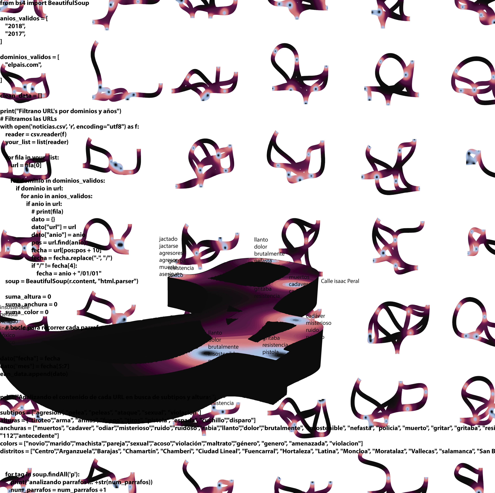

The project aims to understand the relationship between the commission of crimes and the design of urban space where they take place. The approach is made by scraping online news dealing with crime and insecurity in the public space. The diagrams are subsequently made with grasshopper.

 

 

